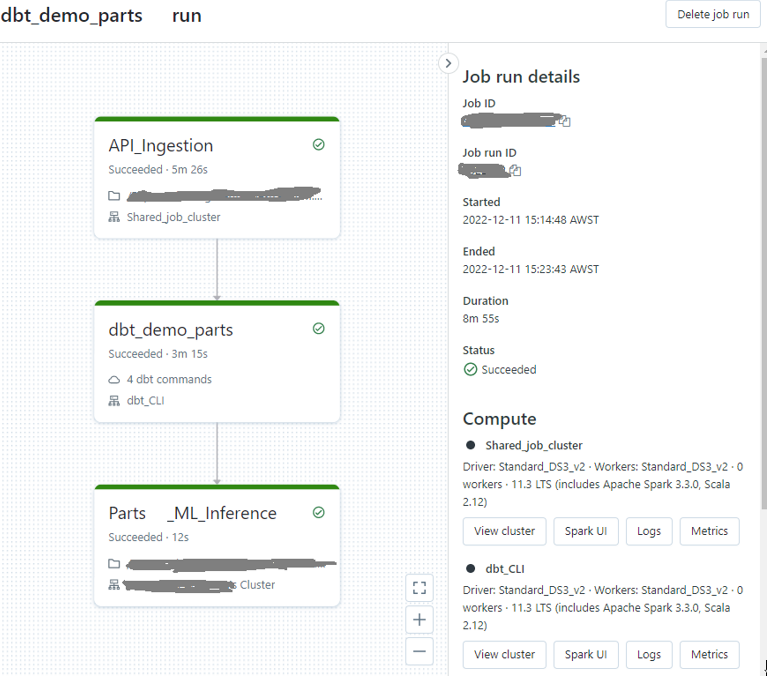

<h1 align="left"> End-to-end Parts Visibility solution</h1>

<!-- TABLE OF CONTENTS -->

  
<b>Table of Contents</b>

  <ol>
    <li><a href="#background"> Project Background</a></li>
    <li><a href="#Solution Architecture">Solution Architecture</a></li>
    <li><a href="#folder-structure">Folder Structure</a></li>
    <li><a href="#theprocess">How it's done</a></li>
      <ul>
        <li><a href="#sad">Solution Architecture Diagram</a></li>
        <li><a href="#data-int">Data Integration</a></li>
        <li><a href="#data-trans">Data Transformation</a></li>
        <li><a href="#data-ochestration">Data Ochestration</a></li>
        <li><a href="#CI/CD">CI/CD</a></li>
      </ul>
    </li>
    <li><a href="#discussion">Discussion, Lesson Learnt and Future Improvement</a></li>
    <li><a href="#contributors">Contributors & Contributions</a></li>
  </ol>

<h2 id="Project Background">Project Background</h2>

 

Parts Visibility dataset allows the Order Management and Parts Supply team to streamline their processes and improve efficiencies. The end-to-end data solution aims to improve collaboration between the supplier, dealers and customers. 
The dataset contains details on what has been ordered, the status and shipment details. This would enable lean business practices and more proficient processes, in turn, improving the dealer experience and customer satisfaction.

 

<!-- WHAT WE USE -->
<h2 id="Solution Architecture">Solution Architecture</h2>
<figure>
 
<figcaption>Created using <a href= "https://app.diagrams.net/">DrawIO</a></figcaption>
</figure>

This project consist of these sections and tools: 
- Integration - API Ingestion :
  * Python version 3.9
  * Databricks Notebooks
- Transformation :
  * dbt
  * Jinja
  * Databricks Workflow
- Orchestration : 
  * Databricks Workflow
- CI/CD pipeline :
  * Azure DevOps

<!-- FOLDER STRUCTURE -->
<h2 id="folder-structure">Folder Structure</h2>

    code
    .
    │
    ├── API-integration
    │   └── databricks_utils
    ├── dbt-transformation
    │   ├── analyses
    │   ├── dbt_packages
    │   ├── logs
    │   ├── macros
    │   ├── models
    │   ├── seeds
    │   ├── snapshots
    │   ├── target
    │   └── test
    ├── screenshots
    ├── workflow
    │   └── Jobs
    ├── .sqlfluff
    ├── .sqlfluffignore
    ├── azure-pipeline.yml
    └── README.md

<!-- THE WHOLE PROCESS OF THE PROJECT -->
 
<h2 id="theprocess">PROCESS OF THE PROJECT</h2>

 
<h2 id="data-int">Data Integration</h2>

 

 
A python code developed in databricks notebook to read data from company’s parts API. It’s been designed to read the last 2 days data from the API. Then it loads it into a parquet file in raw zone folder named as ingestion timestamp. Next step is to read the data from raw zone into a data frame and merge (UPSERT) it into the Parts table in bronze schema. Doing this, parts table in bronze zone is a mirror of source data.

<h2 id="data-trans">Data Transformation</h2>

 
All transformations are done using dbt core hosted on an Azure repository. We have created 2 silver(staging) tables and 3 gold(serving) tables. Models are written in SQL and can be found in the dbt_transformation\models folder. 
 
There are two sources of data in this dbt project which dbt checks the freshness of data everytime it runs as decsribed below in the picture
<figure>
 
</figure>
 
As shown in the picture one of sources is parts table in bronze schema which is an external delta table and is the source of truth for parts API. It means the data in this table is a mirror of parts API source.
 
The other source is statuses table in bronze schema which initalies from a csv file named statuses.csv. It will be added to the bronze schema once the dbt run
<figure>
 
</figure>

 
<b>We have used the following transformation techniques:</b>
<ul>
<li>Renaming - renaming certain column headers to avoid confusion</li>
<li>Data type casting - date string to date type, quantities into integers</li>
<li>Joins - Joins on multiple tables for gold table</li>
<li>Trim - To remove unnecessary spaces from the strings</li>
<li>Distinct - To remove duplications</li>
<li>Aggregation function - sum() for item quantities from distribution center</li>
<li>Filtering - where claused used prevent getting null values for distribution center and using having to filter emergency orders</li>
<li>Grouping - group by distribution center, order type</li>
<li>Sorting - Order By sum() for item quantities </li>
</ul>

 
This project contains 3 generic tests written based on data quality requirements:

* date_format - to test the format of the date columns to ensure it has the right format
* length - to test length of PSO column in parts table to ensure the length is correct
* string_test - to test data types to ensure it is a string format

There are also some more defined tests applied to some of columns like ‘unique’, ‘not null’ if applicable to them.
 
Lineage graph below shows dags used in this project:

<figure> 
 
<figcaption>Lineage-Graph</figcaption>
</figure>

<h2 id="data-ochestration">Data Ochestration</h2>

 
In this project Databricks Workflow has been used as orchestration tool. IT consist of two parts:

1. API ingestion which is a task of running a python notebook which reads the last 2 days of from API(incremental extraction), saves the result as parquet file in a timestamp folder in raw zone in blob storage, then reads the data from raw zone and merge it to existing parts table in bronze schema.
2. Dbt core project to be run as job task and for this purpose dbt task in databricks job has been used. THis helps:

* to use dbt project with other tasks and to automate dbt task
* to monitor dbt transformations and get notifed if any failure happens

<figure> 
 
<figcaption>Darabricks Workflow Orchastration</figcaption>
</figure>

 

<h2 id="CI/CD">CI/CD (Continious Integration / Continious Deployment)</h2>

 

CI/CD pipeline setup has been the challenging part of this project. The tool has been used for this part is Azure DevOps pipeline and because the repo also exist on DevOps repo it was not easy to find the right documentation explaining the setup steps clearly. So this part of the project took longer than other parts but eventualy the setup has been done successfully by creating two seperate pipeline, one CI-Pipeline and ther other one CD-Pipeline.

<figure> 
 
<figcaption>CICD-Pipeline</figcaption>
</figure>

<h3><b> CI Pipeline </b></h3>
This pipeline has been created to make sure the code is built and undergoes initial testing. it consist of two parts:

1. Liniting to automatically check the source code for programmatic and stylistic errors.

<figure> 
 
<figcaption>Linting</figcaption>
</figure>

2. Slim CI which enabled us to only run certain portions of our code tree based on the activity of our last job run. It does this through the creation of a manifest that it used to track various things about the last run. For this purpose, two jobs had to defined:

* First Job consist of these steps:
  - checkout to main branch
  - generate main branch dbt manifest
  - save it into dbt_manifest artifact

<figure> 
 
<figcaption>CI first job</figcaption>
</figure> 

* Second job consist of these steps:
  - check out to the initial branch
  - generate dbt manifest
  - read dbt_manifest artifact created in previous job and compare the manifest of the compiled project to the main branch manifest. By using the --state:modified+ selector in dbt job definition, it will only rebuild the new or changed models.

<figure> 
 
<figcaption>Dbt Slim CI</figcaption>
</figure>                

 

<h3><b> CD Pipeline </b></h3>
This pipeline is to deploy databricks jobs. It installs databricks cli and run a python code which creates the jobs not exist in target.

<figure> 
 
<figcaption>CD Pipeline</figcaption>
</figure> 
 
 The way that deploy job python code works is to check the  job json files under workflow/jobs folder and check if they exist in target databricks workspace. If they dont exist it will create them otherwise wont do anything.

 <figure> 
 
<figcaption>Deploy-Job python code</figcaption>
</figure> 

 

<!-- RESULTS AND DISCUSSION -->

<h2 id="discussion">Lesson Learnt and Future Improvement</h2>

 
<b>Key Learnings</b> 
<ul> 
  <li> Information overload with lack of direction can be painful and time consuming. When lost, always ask for directions.  </li>
  <li>Having an Error message is better than having none at all.  </li>
  <li>When testing out CI/CD, always good to comment out the parts we don't need to speed up the process *Ahem.. Linting*  </li>
</ul>

<b> Room for Improvements:</b>

<ul> 
  <li>Implement API call loop instead of using current iteration on repeating the same code.  </li>
  <li>To include New Column detection as current iteration of Data Ingestion does not check for New Columns.  </li>
  <li>Current CD only checks and deploy by Job name, hence if there are same job settings with a different name, the same "jobs" will be created in Databricks Workflow.  </li>
  <li>Future iteration to include settings matching  so no same "jobs" will be created, only update if neccesary.  </li>
</ul>

<!-- CONTRIBUTORS -->
<h2 id="contributors">Contributors & Contributions</h2>

  <i>All participants in this project are professional individuals enrolled in <a href="https://www.dataengineercamp.com">Data Engineering Camp</a> </i>    
  
<table>
<tr>
<th>Name</th>
<th>GitHub</th>
<th>Contributions</th>
</tr>
<tr>
<td> <b>Fang Xuan Foo</b></td>
<td><a href="https://github.com/foofx88">foofx88</a></td>
<td>API Ingestion, dbt Transformation , CI/CD</td>
</tr>

<tr>
 <td> <b>Helen Amin</b> </td>
  <td><a href="https://github.com/helenamin">helenamin</a> </td>
  <td>dbt Transformation, CI , Documentation</td>
 </tr>

<tr>
 <td> <b>Puneet Verma</b></td>
<td><a href="https://github.com/puneetverma">puneetverma</a></td>
<td>dbt Transformation, CI </td>
</tr>

</table>

<i>All Team members partook on the development,cross check and supplied content for project documentation. </i>
<i>This was the final project for the course in the <a href="https://www.dataengineercamp.com">Data Engineering Camp</a>.</i>  

<a href="#top">GO ⬆</h1></a>
